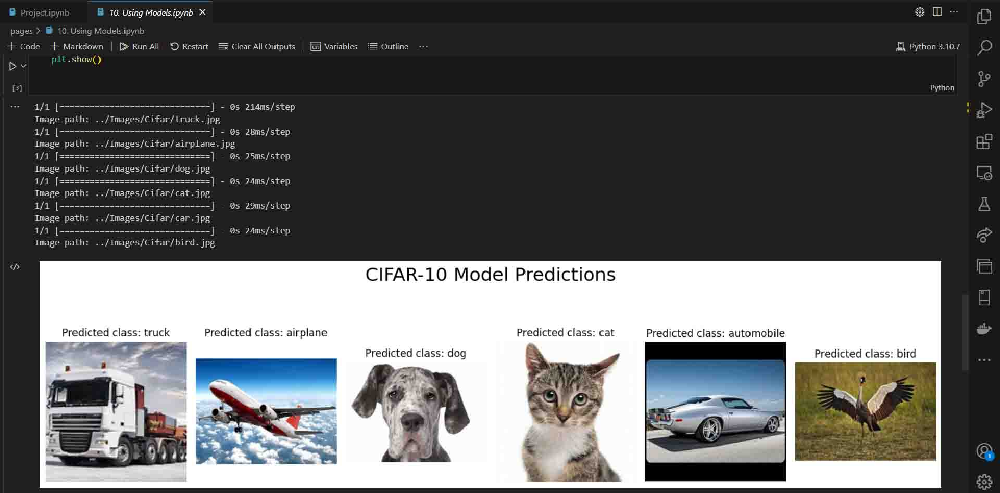

# Image Classification with CIFAR-10 and Fashion MNIST

Welcome to my Image Classification project! This project is implemented in Jupyter Notebook using Python and focuses on the captivating topic of image analysis. I invite you to explore the world of image classification through two prominent datasets: CIFAR-10 and Fashion MNIST.

## Table of Contents

1. [Introduction](#introduction)
2. [Prior Research](#prior-research)
3. [Project Overview](#project-overview)
    - [CIFAR-10](#cifar-10)
    - [Fashion MNIST](#fashion-mnist)
4. [CIFAR-10 Analysis](pages/4.%20CIFAR-10_Experiment.ipynb)
    - [4.1 Image Preprocessing and Frog Images Analysis](pages/4.1%20Frog_Images_Analysis.ipynb)
    - [4.2 Detailed SIFT Analysis with CIFAR-10 Dataset](pages/4.2%20CIFAR10_SIFT_Image_Analysis_Techniques_and_Insights.ipynb)
5. [Fashion MNIST Analysis](pages/5.%20Fashion_MNIST_Analysis.ipynb)
    - [5.1 Anomaly Detection in Fashion MNIST Dataset](pages/5.1%20Anomaly_Detection_in_Fashion_MNIST_Dataset.ipynb)
6. [Models Data Preparation](pages/6.%20Data%20Preparation.ipynb)
7. [Modeling](pages/7.%20Modeling.ipynb)
8. [Training the Models](pages/8.%20Training%20the%20Models.ipynb)
9. [Testing](pages/9.%20Testing%20and%20Performance%20Analysis.ipynb)
10. [Using the Models](pages/10.%20Using%20Models.ipynb)
11. [Conclusion](#conclusion)

## Project Highlights

Throughout this project, I've embarked on a journey of research, exploration, and analysis. Some of the project's highlights include:

- Leveraging techniques such as Histogram of Oriented Gradients (HOG) and Scale-Invariant Feature Transform (SIFT).
- Thorough analysis, visualization, and interpretation of the CIFAR-10 and Fashion MNIST datasets.
- Investigating anomaly detection in the Fashion MNIST dataset.
- Preparing, modeling, training, and testing machine learning models.
- Drawing insights and conclusions from a wealth of visualizations and experiments.

## Screenshots

Here are some sample screenshots from the Image Classification project:

## Conclusion

I am thrilled to share the results of this image classification project. By combining hands-on experience, experimentation, and analytical insights, I've delved into the exciting world of image analysis. This repository stands as a testament to the fascinating intersection of machine learning and image classification.

Happy exploring, learning, and coding!
